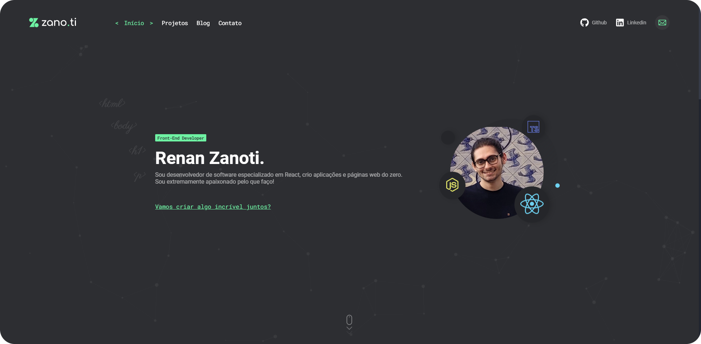

  

  <h3 align="center">Portfólio - Renan Zanoti</h3>

  

    Este projeto faz parte do meu currículo de habilidade, trata-se do código fonte do meu portfólio pessoal.
     
    <a href="https://zanoti.dev" target="_blank"><strong>Acesse agora »</strong></a>
     
     
    <a href="https://zanoti.dev/ target="_blank"">View Demo</a>
    ·
    <a href="https://github.com/renanzan/zanoti-website/issues">Report Bug</a>
  

	

## 💼 Tecnologias utilizadas
Este projeto foi construído usando as seguintes tecnologias.
- ReactJS
- NextJS
- styled-components
- framer-motion
- TypeScript

## 👨‍💻 Autor

:technologist: Renan Zanoti - Desenvolvedor front-end especialista em ReactJS.

<table>
  <tr>
    <td align="center">
      <a href="https://github.com/renanzan">
         
        
          <b>Renan Zanoti</b>
        
      </a>
    </td>
  </tr>
</table>

- Github: [@renanzan](https://github.com/renanzan)
- Linkedin: [Renan Zanoti](https://www.linkedin.com/in/renanzan/)
- Gmail: [rh.zanoti@gmail.com](mailto:rh.zanoti@gmail.com)

## ⚙️ Demostração

Você pode acessar a versão online [aqui](https://zanoti.dev).
